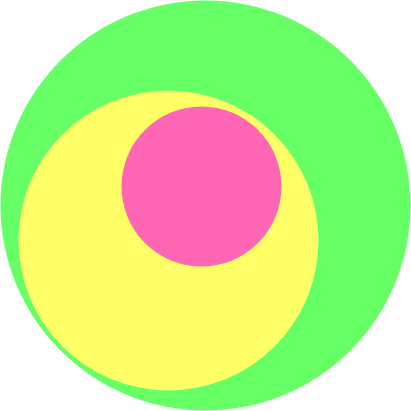

<!-- 
footer: @imflash217 | flashAI.labs | 2017-2019 
-->

<style>
section {
    font-family: "Fira Code";
    font-size: 20px;
    background-image: linear-gradient(135deg, #fdfcfb 0%, #e2d1c3 100%);
}

.language-javascript,
.language-python{
    font-family: "Fira Code";
}
</style>

---



---
<!-- _header: Roadmap -->

- ML Foundation:
    - Function Approximation & Generalization Guarantees
    - Decision Tree Learning
    - Overfitting & Validation
    - Pruning Techniques `later`
    - Naive Bayes & MLE/MAP estimates `optional`
    - SVMs & Random Forests `optional`
- Neural Networks:
    - Linear Classification & Regression
    - Backpropagation
    - Feed-forward Deep Neural Networks (DNN)
    - Convolutional Neural Networks (CNN)
    - Overfitting & Cross-validation `revisted`
    - Various Weight Initialization Strategies
    - Recurrent NN, LSTMs & GRUs
    - CNN implemenation in `PyTorch`
    - LSTM implementation in `PyTorch`

---
<!-- _header: What is Machine Learning? -->
Three main parameters in understanding, designing & debugging any machine learning algorithm:
- Performane `P`
- Task `T`
- Experience `E`

So, any machine learning algorithm is merely just a **well defined learning task** $<P,T,E>$

Some examples we'll see: Emergency C-sections, Playing forecasts, etc.

---
<!-- _header: Function Approximation -->
Problem Setting:
- Set of possible instances $\bold{X}$
- Unknown target function $f: \bold{X}\rightarrow \bold{Y}$
- Set of function hypotheses $H = \{h|h:\bold{X}\rightarrow \bold{Y}\}$

Inputs:
- Training examples $\{<x_{i}, y_{i}>\}$ of unknown target function $f$

Output:
- Hypothesis $h \in H$ which best approximates $f$

---
<!-- header: Decision Trees -->
Problem Setting:
- Set of possible instances $\bold{X}$
    - Each Instance $x$ in $\bold{X}$ is a FEATURE VECTOR
    - $x = <x_{1}, x_{2}, x_{3} ... x_{n}>$
- Unknown target function $f: \bold{X}\rightarrow \bold{Y}$
    - $\bold{Y}$ is descrete valued
- Set of function hypotheses $H = \{h|h:\bold{X}\rightarrow \bold{Y}\}$
    - Each hypothesis $h$ is a DT

Inputs:
- Training examples $\{<x^{i}, y^{i}>\}$ of unknown target function $f$

Output:
- Hypothesis $h \in H$ which best approximates $f$

---
$f: \langle\text{OUTLOOK, TEMP, HUMIDITY, WIND}\rangle \rightarrow \text{PLAY}?$

```python
DAY     OUTLOOK     TEMP    HUMIDITY    WIND  | PLAY?
------------------------------------------------------
1       sunny       hot     high        weak    False
2       sunny       hot     high        strong  False
3       overcast    hot     high        weak    True
4       rain        mild    high        weak    True
5       rain        cool    normal      weak    True
6       rain        cool    normal      strong  False
7       overcast    cool    normal      strong  True
8       sunny       mild    high        weak    False
```

---
**Problem Setting:**
- Set of possible instances $\bold{X}$
    - Each Instance $x$ in $\bold{X}$ is a **FEATURE VECTOR**
    - For eg: $x = <Outlook=Sunny, Temp=Hot, Humidity=High, Wind=Weak>$
- Unknown target function $f: \bold{X}\rightarrow \bold{Y}$
    - $\bold{Y}$ is descrete valued
    - For eg: Here, $y^{i}=Yes$ if we play else $No$
- Set of function hypotheses $H = \{h|h:\bold{X}\rightarrow \bold{Y}\}$
    - Each hypothesis $h$ is a DT
    - Trees sort $x$ to leaf-node, which assigns $y$

**Inputs:**
- Training examples $\{<x^{i}, y^{i}>\}$ of unknown target function $f$

**Output:**
- Hypothesis $h \in H$ which best approximates $f$


---

```python
OUTLOOK = sunny:
|   HUMIDITY = high:    False
|   HUMIDITY = normal:  True
OUTLOOK = overcast:     True
OUTLOOK = rain:
|   WIND = strong:      False
|   WIND = weak:        True

```


**Strategy:**
- Internal Node: test one discrete-valued attribute $x_{i}$
- Brach from a node: select one value for $x_{i}$
- leaf node: predict $Y$ or ($P(Y|X \in leaf)$)

---
<!-- header: Decision Trees: Examples -->
- How would you represent following functions as DT?
    - $Y = X_{1}X_{2}$
    - $Y = X_{1} \vee X_{2}$
    - $Y = X_{1}X_{2} \vee X_{3}X_{4}(\neg X_{1})$

---
# Emergency C-sections risk prediction using DT
- 1000 medical records
- Negative examples are C-sections

```python
                                        [833+,  167-] 0.83+ 0.17-

Fetal_Presentation = 1:                 [822+,  116-] 0.88+ 0.12-
|   Previous_C-section = 0:             [767+,   81-] 0.90+ 0.10-
|   |   Primiparous = 0:                [399+,   13-] 0.97+ 0.03-
|   |   Primiparous = 1:                [368+,   68-] 0.84+ 0.16-
|   |   |   Fetal_Distress = 0:         [334+,   47-] 0.88+ 0.12-
|   |   |   |   Birth_weight <  3349g:  [201+, 10.6-] 0.95+ 0.05-
|   |   |   |   Birth_weight >= 3349g:  [113+, 36.4-] 0.78+ 0.22-
|   |   |   Fetal_Distress = 1:         [ 34+,   21-] 0.62+ 0.38-
|   Previous_C-section = 1:             [ 55+,   35-] 0.61+ 0.39-
Fetal_presentation = 2:                 [  3+,   29-] 0.11+ 0.89-
Fetal_Presentation = 3:                 [  8+,   22-] 0.27+ 0.73-
```

---
<!-- header: Top-Down Induction of DT (an ID3 approach)-->
```python
tree.root = ROOT
def loop(tree, node):
    node.next = A                   #The BEST decision attribute for next node based on some CRITERION
    for ex in examples:
        result = sort(ex, tree)     # returns a sequence of 0 & 1 (0=not_fully_sorted till leaf node)
    if 0 in result:
        loop(tree, node.next)
    else:
        break;

loop(tree, tree.root)
```
---
But there is a problem!!!
How do we select the **BEST attribute** for an node?? :thinking:
Which **CRITERION** we used to make this decision?

What are some possible **CRITERIA**??

How well can we define our problem (the ones we saw before)?
What was our **objective**? accuracy :thinking: error :thinking: or something else??

---
If we ponder carefully, we will notice that our _objective_ was to **classify the data as PURELY as possible**

This brings us to one of the most commonly known & widely used metric for classification **purity** called **ENTROPY**

NOTE: 
- Though there can be arguments in favour of _accuracy_ or _error_ metrics too, these provide less generalization-gurantees ('ll see later)
- Fundamentally, any CONCAVE function is well suited* to be used as a classification criterion ('ll see later) 

---
<!-- header: ENTROPY -->
"Defines how impure a group is."

$\mathcal{H}(X) = -\sum\limits_{i=1}^{n}{P(X=i)\log_{2}{P(X=i)}}$

---

==Render inline== math such as $ax^2+bc+c$.

$$ I_{xx}=\int\int_Ry^2f(x,y)\cdot{}dydx $$

$$
f(x) = \int_{-\infty}^\infty
    \hat f(\xi)\,e^{2 \pi i \xi x}
    \,d\xi
$$

---

```python
class WowMagic:
    def __init__(self, magic):
        self.magic = magic
        self.authenticity = True
    def foolPeople(response):
        if response:
            continue
        else:
            pass
```

---
```css
%reset-button {
  border: none;
  margin: 0;
  padding: 0;
  width: auto;
  overflow: visible;

  background: transparent;

  /* inherit font & color from ancestor */
  font: inherit;
  color: inherit;

  /* Normalize `line-height`. Cannot be changed from `normal` in Firefox 4+. */
  line-height: normal;

  /* Corrects font smoothing for webkit */
  -webkit-font-smoothing: inherit;
  -moz-osx-font-smoothing: inherit;

  /* Corrects inability to style clickable `input` types in iOS */
  -webkit-appearance: none;

  // /* Remove excess padding and border in Firefox 4+ */
  &::-moz-focus-inner {
    border: 0;
    padding: 0;
  }
}

```

---

```javascript

module.exports = {
  ogImage: process.env.URL && `${process.env.URL}/og-image.jpg`,
  url: process.env.URL,
}

module.exports = {
  ogImage: process.env.URL && `${process.env.URL}/og-image.jpg`,
  url: process.env.URL,
}

module.exports = {
  ogImage: process.env.URL && `${process.env.URL}/og-image.jpg`,
  url: process.env.URL,
}

module.exports = {
  ogImage: process.env.URL && `${process.env.URL}/og-image.jpg`,
  url: process.env.URL,
}

module.exports = {
  ogImage: process.env.URL && `${process.env.URL}/og-image.jpg`,
  url: process.env.URL,
}

module.exports = {
  ogImage: process.env.URL && `${process.env.URL}/og-image.jpg`,
  url: process.env.URL,
}

module.exports = {
  ogImage: process.env.URL && `${process.env.URL}/og-image.jpg`,
  url: process.env.URL,
}
```

---

# 


##### Markdown presentation writer, powered by [Electron](http://electron.atom.io/)


###### Created by Yuki Hattori ( [@yhatt](https://github.com/yhatt)  )


---

# Features


**Slides are written in Markdown.**
- Cross-platform. Supports Windows, Mac, and Linux
- Live Preview with 3 modes
- Slide themes (`default`, `gaia`) and custom background images
- Supports emoji :heart:
- Render maths in your slides
- Export your slides to PDF


---


# How to write slides?


Split slides by horizontal ruler `---`. It's very simple.

```md
# Slide 1
foobar
```

---


# Slide 2

foobar

**Notice: Ruler (`<hr>`) is not displayed in Marp.**


---


# Directives


Marp's Markdown has extended directives to affect slides.

Insert HTML comment as below:

```html
<!-- {directive_name}: {value} -->
```

```html
<!--
{first_directive_name}:  {value}
{second_directive_name}: {value}
...
-->
```
---
<!-- fit -->
## Global Directives


### `$theme`

Changes the theme of all the slides in the deck. You can also change from `View -> Theme` menu.

```
<!-- $theme: gaia -->
```

|Theme name|Value|Directive|
|:-:|:-:|:-|
|***Default***|default|`<!-- $theme: default -->`
|**Gaia**|gaia|`<!-- $theme: gaia -->`

---

### `$width` / `$height`

Changes width and height of all the slides.

You can use units: `px` (default), `cm`, `mm`, `in`, `pt`, and `pc`.

```html
<!-- $width: 12in -->
```

### `$size`

Changes slide size by presets.

Presets: `4:3`, `16:9`, `A0`-`A8`, `B0`-`B8` and suffix of `-portrait`.

```html
<!-- $size: 16:9 -->
```

<!--
$size: a4

Example is here. Global Directive is enabled in anywhere.
It apply the latest value if you write multiple same Global Directives.
-->

---

## Page Directives

The page directive would apply to the  **current page and the following pages**.
You should insert it *at the top* to apply it to all slides.

### `page_number`

Set `true` to show page number on slides. *See lower right!*

```html
<!-- page_number: true -->
```

<!--
page_number: true

Example is here. Pagination starts from this page.
If you use multi-line comment, directives should write to each new lines.
-->

---

### `template`

Set to use template of theme.

The `template` directive just enables that using theme supports templates.

```html
<!--
$theme: gaia
template: invert
-->
```

Example: Set "invert" template of Gaia theme.

---

### `footer`

Add a footer to the current slide and all of the following slides

```html
<!-- footer: This is a footer -->
```

Example: Adds "This is a footer" in the bottom of each slide

---

### `prerender`

Pre-renders a slide, which can prevent issues with very large background images.

```html
<!-- prerender: true -->
```

---

## Pro Tips

#### Apply page directive to current slide only

Page directive can be selectively applied to the current slide by prefixing the page directive with `*`.

```
<!-- *page_number: false -->
<!-- *template: invert -->
```

<!--
*page_number: false

Example is here.
Page number is not shown in current page, but it's shown on later pages.
-->

---

#### Slide background Images

You can set an image as a slide background.

```html

```

Options can be provided after `bg`, for example ``.

Options include:

- `original` to include the image without any effects
- `x%` to include the  image at `x` percent of the slide size
- Include multiple`` tags to stack background images horizontally.

---

#### Maths Typesetting
Mathematics is typeset using the `KaTeX` package. Use `$` for inline maths, such as $ax^2+bc+c$, and `$$` for block maths:
$$I_{xx}=\int\int_Ry^2f(x,y)\cdot{}dydx$$

```html

This is inline: $ax^2+bx+c$, and this is block:
$$I_{xx}=\int\int_Ry^2f(x,y)\cdot{}dydx$$


---

## Enjoy writing slides! :+1:

### https://github.com/yhatt/marp

Copyright &copy; 2016 [Yuki Hattori](https://github.com/yhatt)
This software released under the [MIT License](https://github.com/yhatt/marp/blob/master/LICENSE).
a
asa
aasdasd
asas
asds
ddd
a
adadd

addd

a
d
ddda
dad
adad
